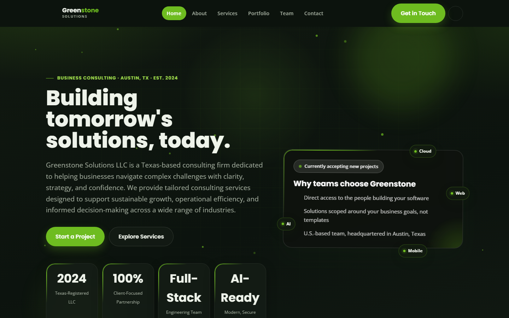
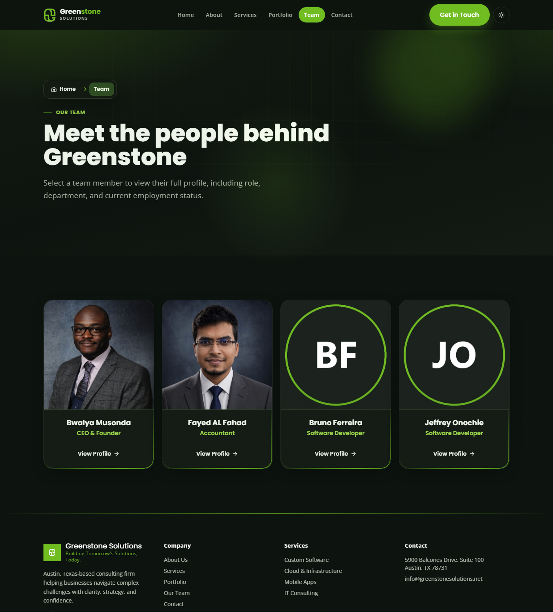
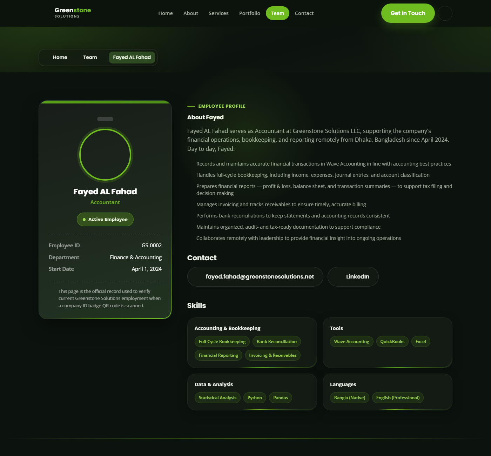
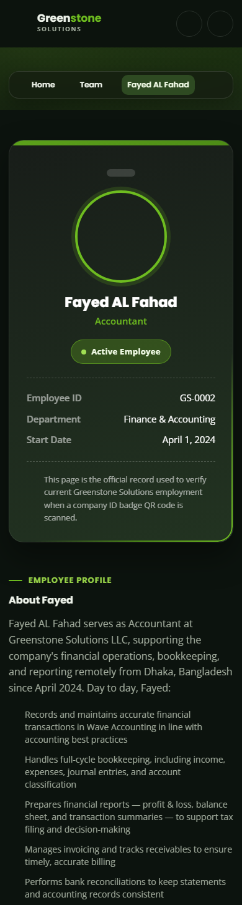

<div align="center">
  

  <h3>The official marketing website for Greenstone Solutions LLC</h3>
  <p>A Texas-based consulting firm helping businesses navigate complex challenges with clarity, strategy, and confidence.</p>

  <p>
    
    
    
    
    
    
  </p>

  <a href="https://greenstonesolutions.net">🌐 Live Site</a>
</div>

<br>



---

## About

**Greenstone Solutions** is a business consulting firm founded in 2024 and headquartered in Austin, Texas. This repository contains the source for the company's public website — a React application built on **TanStack Start** (file-based routing + SSR via Vite/Nitro), styled with **Tailwind CSS v4**, and fully typed with TypeScript.

## ✨ Features

- 🎨 **Light & dark mode** — theme is detected from system preference, toggleable, and persisted
- 🧭 **File-based routing** — powered by `@tanstack/react-router`, with SSR/streaming via `@tanstack/react-start`
- 🪟 **Glass & moss UI** — tilt cards, spinning live-borders, scroll-reveal animations, and a signature green/charcoal palette
- 👥 **Dynamic team directory** — profile "ID badge" pages generated per employee from a single data source
- 📱 **Fully responsive** — mobile-first layouts, tuned to avoid overflow on narrow viewports
- ♿ **Accessible by default** — skip links, ARIA labeling, `prefers-reduced-motion` support, semantic markup
- 📦 **PWA-ready** — installable app manifest and install-tutorial page served via a custom Vite/Nitro plugin
- 🔍 **SEO-ready** — Open Graph metadata, canonical URLs, sitemap, and `robots.txt`

## 📸 Screenshots

<table>
  <tr>
    <td align="center" width="50%">
      <br>
      <sub>Team directory — equal-height cards, actions aligned across the row</sub>
    </td>
    <td align="center" width="50%">
      <br>
      <sub>Employee "ID badge" profile page</sub>
    </td>
  </tr>
</table>

<div align="center">
  <br>
  <sub>Employee profile — mobile</sub>
</div>

## 🗂️ Site Map

| Page | Route | Description |
|---|---|---|
| Home | `/` | Hero, services overview, and company highlights |
| About | `/about` | Company story and mission |
| Services | `/services` | Custom software, cloud & infrastructure, mobile apps, IT consulting |
| Portfolio | `/portfolio` | Selected project work |
| Team | `/team` | Team directory grid |
| Team member | `/team/$slug` | Individual employee profile ("ID badge") page |
| Contact | `/contact` | Get in touch |

## 📁 Project Structure

```
Greenstone Website/
├── src/
│   ├── routes/              # File-based routes (TanStack Router)
│   │   ├── __root.tsx        # App shell: header, footer, theme, meta
│   │   ├── index.tsx          # Home page
│   │   ├── about/, services/, portfolio/, contact/
│   │   └── team/
│   │       ├── index.tsx      # Team directory grid
│   │       └── $slug.tsx      # Individual employee profile
│   ├── components/           # Header, footer, cards, reveal/tilt effects, etc.
│   ├── data/
│   │   └── site-data.ts       # Single source of truth: company info, nav, services, team
│   ├── assets/css/style.css   # Design tokens (Tailwind @theme) + component styles
│   └── lib/                  # Shared utilities
├── server/
│   └── middleware/            # Server-side (Nitro) request middleware
├── scripts/                  # Build-time plugins (PWA install page/manifest)
├── public/assets/images/     # Logos, favicons, team headshots
├── vite.config.ts             # Vite + TanStack Start + Tailwind + Nitro config
└── tsconfig.json
```

## 🚀 Getting Started

**Requirements:** Node.js 18+

```bash
npm install
npm run dev
```

Then open [http://localhost:8080](http://localhost:8080) in your browser.

### Other scripts

| Command | Description |
|---|---|
| `npm run dev` | Start the dev server with HMR |
| `npm run build` | Production build (SSR bundle via Nitro, Vercel preset) |
| `npm run preview` | Preview the production build locally |
| `npm run typecheck` | Type-check the project with `tsc --noEmit` |

## 🛠️ Tech Stack

- **[React 19](https://react.dev)** — UI library
- **[TanStack Router](https://tanstack.com/router) + [TanStack Start](https://tanstack.com/start)** — file-based routing, SSR, streaming
- **[Vite](https://vitejs.dev)** + **[Nitro](https://nitro.build)** — dev server & production build/server (Vercel preset)
- **[Tailwind CSS v4](https://tailwindcss.com)** — utility-first styling with design tokens
- **TypeScript** — strict typing throughout
- **[lucide-react](https://lucide.dev)** — icon set

## 📄 License

Licensed under the [MIT License](LICENSE) © 2026 Fayed AL Fahad.

---

<div align="center">
  <sub>Built with care in Austin, Texas 🌱</sub>
</div>
